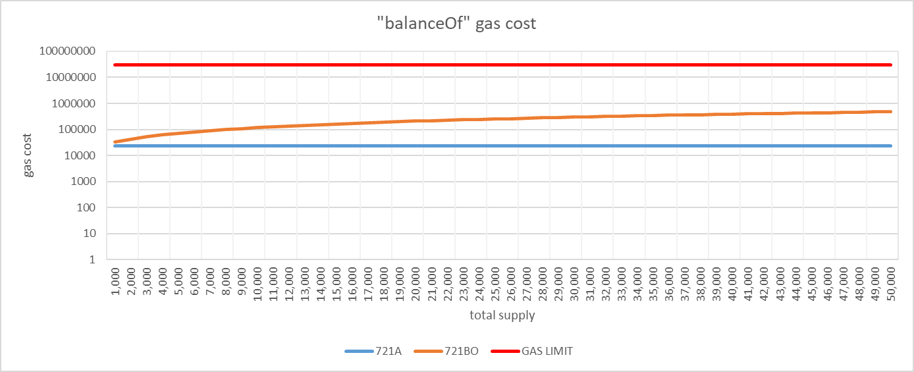
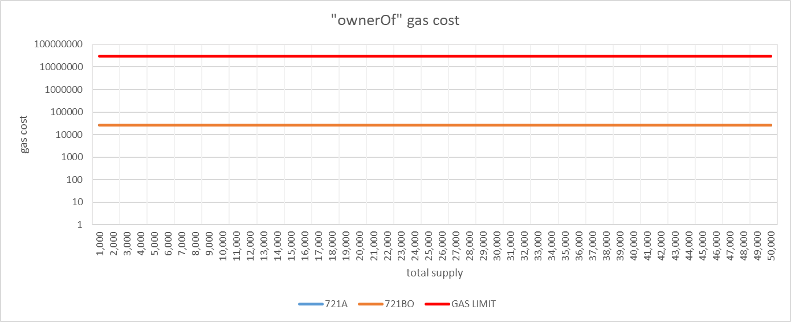
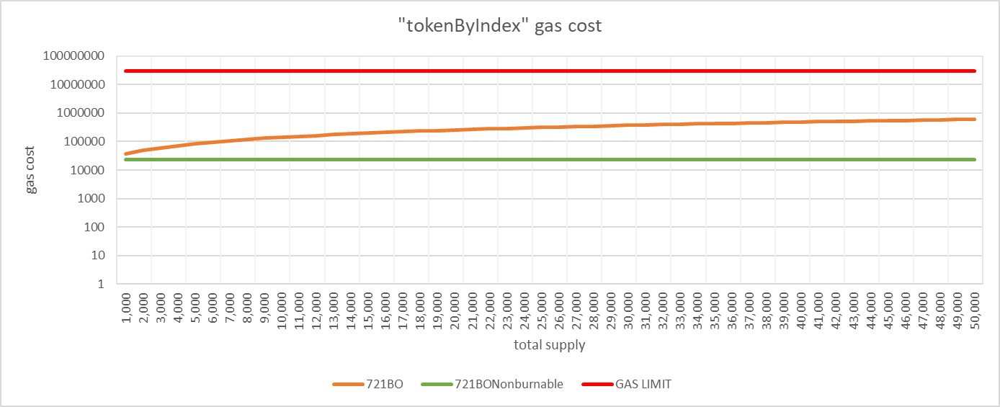
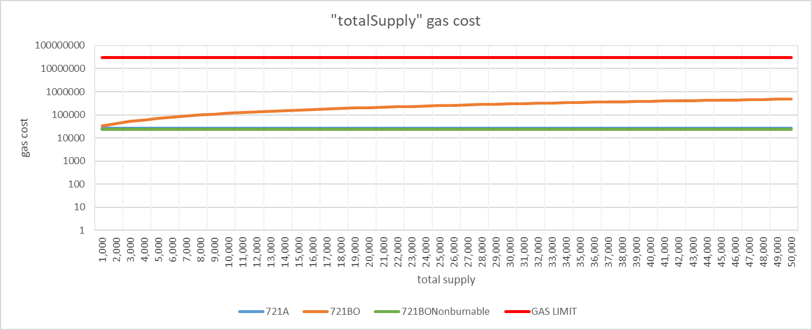

# Performance

Modifications of the ERC721 optimized for specific use cases increase the gas cost of any of the static calling in many cases.
Therefore, when handling a large number of tokens, the gas cost per call may exceed the limit and the call may fail.
Since ERC721B0 planned to handle more than 10,000 tokens, benchmark was performed to compare with ERC721A.

As a result, for all benchmarks, the gas cost when executed as part of a transaction was comparable to that of the ERC721A.
In addition, for static calling, the gas cost did not exceed the upper limit of 30 million gases.

## Execute as part of a transaction

### batch mint
Measurements were taken with 1 to 5 batch mints. Note that ERC721 and ERC721Enumerable do not support batch minting, so we minted one each in each transaction.

| Mint Count |  ERC721 | ERC721Enumerable | ERC721A (v4.2.2) | ERC721BO |
|:----------:|--------:|-----------------:|-----------------:|---------:|
|     1      |  51,488 |          100,237 |           56,344 |   57,188 |
|     2      |  77,316 |          215,426 |           58,277 |   59,140 |
|     3      | 102,467 |          329,938 |           60,210 |   61,092 |
|     4      | 127,618 |          444,450 |           62,143 |   63,044 |
|     5      | 152,769 |          558,962 |           64,076 |   64,996 |

### safeTransferFrom and burn
We measured the transfer and burn of one token each.

|     Function     | ERC721 | ERC721Enumerable | ERC721A (v4.2.2) | ERC721BO |
|:----------------:|-------:|-----------------:|-----------------:|---------:|
| safeTransferFrom | 60,049 |           68,094 |           64,079 |   64,385 |
|       burn       | 30,704 |           43,280 |           60,376 |   58,655 |

## static calling
ERC721BONononburnable, an extension of ERC721BO, reduces the gas cost of some static calling compared to ERC721BO.
Therefore, for some benchmarks, ERC721BONononburnable was also included in the measurements.

### tokenOfOwnerByIndex
ERC721A (v4.2.2) does not implement `tokenOfOwnerByIndex` and uses `tokensOfOwner` insteadly which has similar functionality.
Therefore, the benchmark scenario has been adjusted to minimize the impact of the specification differences.

### balanceOf

### ownerOf
ERC721A and ERC721BO resulted in comparable gas costs.

### tokenByIndex
Since ERC721A does not have a `tokenByIndex` equivalent, only ERC721BO and ERC721BONonburnable were measured.

### totalSupply
ERC721A and ERC721BONonburnable resulted in comparable gas costs.

