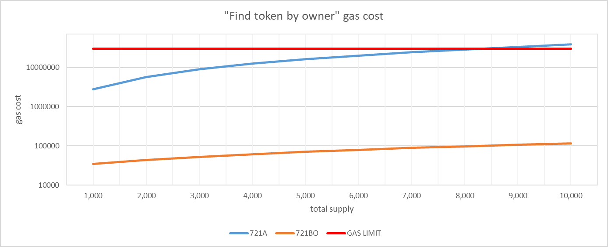

# ERC721BO

## About ERC721BO

ERC721BO is a smart contract development library which enables a single transaction to create or manage multiple NFTs, compatible with ERC721Enumerable.

On the condition, this library provide an interface between ERC721 and ERC721Enumerable.
However, it is different from typical relationship between ERC721 and ERC721Enumerable.
It has an ownership management mechanism with lazy initialization and flag feature inspired by ERC721A.

You can see the detail in [Design](#design).

As a another feature, this library maintain the same standard with ERC721A for the gas cost.
The following is the Batch Mint case as an example.

| Mint Count |  ERC721 | ERC721Enumerable | ERC721A (v4.2.2) | ERC721BO |
|:----------:|--------:|-----------------:|-----------------:|---------:|
|     1      |  51,488 |          100,237 |           56,344 |   57,188 |
|     2      |  77,316 |          215,426 |           58,277 |   59,140 |
|     3      | 102,467 |          329,938 |           60,210 |   61,092 |
|     4      | 127,618 |          444,450 |           62,143 |   63,044 |
|     5      | 152,769 |          558,962 |           64,076 |   64,996 |


With the assumption, ERC721A is tend to increase its gas cost in proportion to the total supply of token, 
in the feature that acquires owend token ID per address.
Basically,this features doesn’t really cause a problem because it is not included in transaction and called from external program.
However, gas limit set by its networks may fail its calling out.
ERC721BO enables the system to hundle more than 10K token at the same time.




For more information on these benchmarks, see [Performance](docs/performance.md).

### Installation
```bash
npm install erc721bo
```

### Usage
```solidity
pragma solidity ^0.8.0;

import "@eggproject/contracts/ERC721BO.sol";

contract MyCollectible is ERC721BO {
    constructor() ERC721("MyCollectible", "MCO", "https://example.com/") {
    }
}
```

For more detail, you can see OpenZeppelin document as follows:
https://docs.openzeppelin.com/learn/developing-smart-contracts

For details on all APIs, see [ERC721BO API Reference](docs/api/ERC721BO.md).

## Design

### lazy initialization mechanism
ERC721BO applies lazy initialization mechanism inspired by ERC721A. 
In ERC721, owner’s address is directly mapped into token ID in order to manage token’s owners.
However, ERC721A is implementing the following 3 `SSTORE` for creating sequential token ID without the volume of mint.

> 1. Initialize the ownership slot at the starting token ID with the address.
> 2. Update the address’ balance.
> 3. Update the next token ID.

https://chiru-labs.github.io/ERC721A/#/design

As a result of this feature, no matter how many the volume of mint is implemented, gas cost is stable.
ERC721BO also applies this mechanism. Furthermore, it improved and reduced the number of writing of data into storage.

For example, in the case that Alice minted ID from 1 to 5 and Bob minted ID from 6 to 10, the whole picture is the following.


In usual ERC721 development, address is saved in each ID from 1 to 5, on the other hand,
ERC721A saves Alice’s address in ID1. As a result,
there is only one time `SSTORE` even though it basically requires 5 times `SSTORE`.

However, in the case of TRANSFER, there are cases where two `SSTORE`s are required.
As instance, when Alice gives ID 2 to Carol, the whole figure is the following.


In this case, one time `SSTORE` to store the owner's address for the transferred token ID 2.

In addition, when the token ID 2 + 1 = 3,  if it is a minted token and `address(0)` is stored,
an additional `SSTORE` is performed, resulting in up to two writing of data.

To solve this problem, the ERC721BO simultaneously stores the owning address and its number for each token ID and adjusts the algorithm to search for the owner of each token ID.

As an example, as seen in ERC721A, Alice mints tokens with ID from 1 to 5, Bob mints tokens with ID from 6 to 10,
and the token with ID 2 is transferred to Carol as shown below.


In this case, `SSTORE` occurs only once to store the owner's address and its number for the transferred token ID.

The algorithm for searching for the owner of each token ID is described below.

The general flow of the search is to obtain and search for the owner's address and its owned number over decrementing the token ID as a reference.
If the decremented token ID and its number which is firstly found is greater than or equal to the token ID at the start of the search, 
the address can be determined to be the owner of the token ID.

For example, if `n=4` for the token ID to be searched, `m=5` for the number of Alice cards, 
and `k=1` for the number of Carol cards, the search is performed in the following order:

1. Get data for token `ID=4`
   1. no data stored, go to next 2.
2. Get data for token `ID=3`
   1. no data saved, go to next
3. Get data for token `ID=2` i. `(2 + k)` is greater than `n`
   1. `(2 + k)` is less than `n` and the condition is not satisfied, go to next
4. Get data of token `ID=1` i. `(1 + m)` is less than `n` and condition is not satisfied, go to next
   1. It is judged that the owner is Alice because `(1 + m)` is greater than `n` and the condition is satisfied


However, even with this method, the number of cases in which two `SSTORE` occur cannot be reduced to zero.
In the following cases, two times `SSTORE` will occur.


This is because it is not a data save against an empty slot,
but an overwrite against a slot that already has data stored. However, as an example, 
in the case of a batch mint for 5 unit, 
the average gas cost for transfer is reduced to 1 token ID for every 5 token IDs that would result in 2 `SSTORE`.

### Ownership management by flag
ERC721BO supports ERC721Enumerable while introducing flag-based ownership management to reduce the number of `SSTORE`.
In many programming languages, the so-called int type (4 bytes) or long type (8 bytes) is the data size typically handled at one time. 
However, the Solidity language, which is commonly used in smart contracts, can handle integer values of up to 32 bytes at a time. 
Therefore, 256 flags can be managed together per variable (1 word).

The ERC721BO implementation considers 256 flags as a single `page` and manages 256 token ownership flags on a single `page`.
In addition, as shown in the figure below, having multiple `page` for each ownership address allows for efficient management of a large number of tokens.


Additionally, it also works well with storage read/write of data, with 32 bytes of data as one word, 
and the gas cost increases with each word. Therefore, by managing 256 flags per word, 
the number of `SSTORE` can be reduced. For example, up to 256 batch mints can be done in one `SSTORE`.

## License
This library is under the MIT License.
